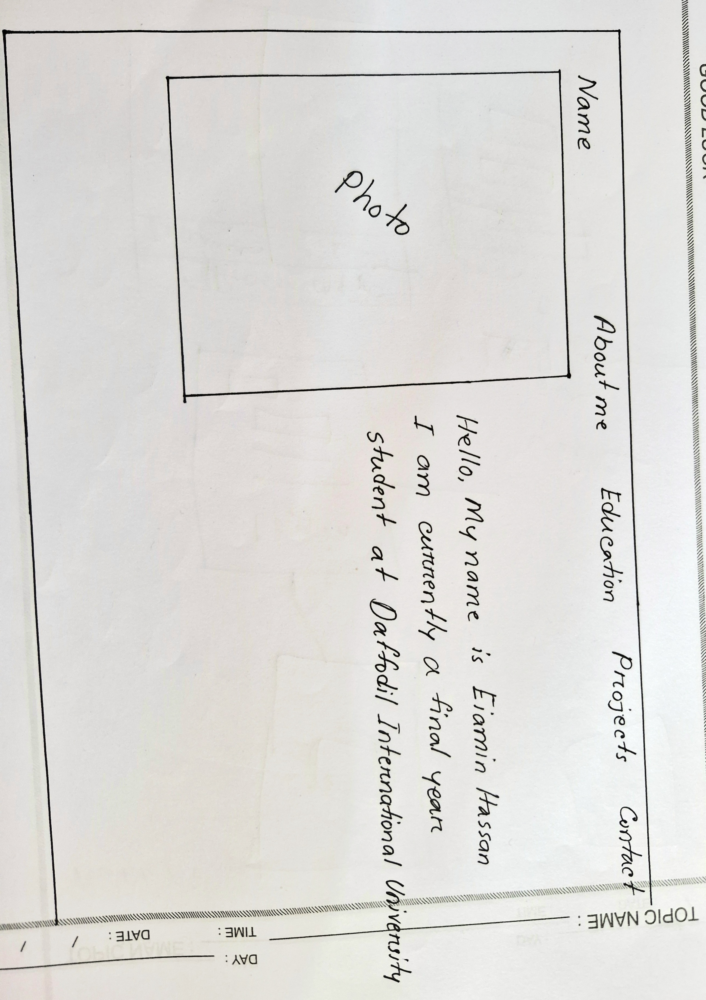

# 🧑‍💻 Eiamin Hassan - Dynamic Full Stack Portfolio

Welcome to my personal **full stack dynamic portfolio** project! This repository contains the source code for my interactive portfolio website, built to showcase my education, projects, and contact information.

---

## ✨ Overview

This portfolio is designed with the following dynamic sections:
- **Home**: Quick intro with profile photo
- **About Me**: Short bio and career goals
- **Education**: Academic background
- **Projects**: Featured works with links
- **Contact**: Get in touch with me

The layout is based on the sketch below:

---

